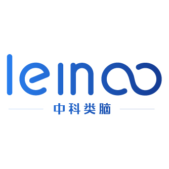

  

<h1 align="center">合肥中科类脑智能技术有限公司</h1>
<h3 align="center">推动前沿智能技术落地，助力产业数智升级</h3>

  <a href="https://www.leinao.ai"> 官网</a> &nbsp;|&nbsp;
  <a href="mailto:business@leinao.ai"> 商务合作</a> &nbsp;|&nbsp;
  <a href="mailto:media@leinao.ai"> 媒体合作</a> &nbsp;|&nbsp;
  <a href="mailto:HR@leinao.ai"> 加入我们</a>

---

## 关于我们

合肥中科类脑智能技术有限公司成立于 2017 年 9 月，是一家专注于类脑智能技术研发与产业化应用的国家级专精特新**"小巨人"**企业。

公司依托**类脑智能技术及应用国家工程实验室**等重大科研平台，是实验室迄今唯一技术成果转化单位，持续促进人工智能与实体经济深度融合。

---

## 核心业务

###  类脑异构计算系统
提供异构算力统一调度与 AI 任务优化服务。

###  类脑多模态大模型
服务电网设备健康诊断、配网缺陷识别与新能源智慧运维，全面覆盖发、输、变、配、用各环节。

###  算电碳协同智慧系统
实现算力与电力资源的动态匹配与优化调度，并拓展虚拟电厂运营与 AI 电力交易服务。

---

## 我们的成绩

-  累计落地项目超过 **1000 项**
-  智慧能源方案覆盖全国 **24 个省份**
-  助力变电站、风电场、光伏电站实现少人 / 无人化运维
-  服务多家能源企业、高校及科研机构

> 由公司牵头建设的**皖疆人工智能科技产业园**，积极促进东西部协作与算力基础设施融合发展。

---

## 联系我们

| 类型 | 邮箱 |
|------|------|
|  商务合作 | business@leinao.ai |
|  媒体合作 | media@leinao.ai |
|  加入我们 | HR@leinao.ai |
